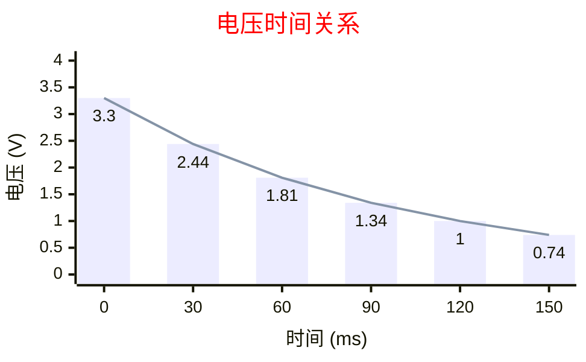

## 博客BUG

1. 标题H1重复，导致bing无法成功收录
1. google 搜索图标异常
1. 博客搜索界面跳转存在异常，如果在本页面搜索本页面的内容将无法跳转，仍会跳转到搜索页面
1. 目前文章通过侧边栏展示内容目录，但是所有内容没有分类，完全的机载一起，后续是否可以增加一个档案页面，将内容分类并以目录的形式可以跳转到指定博客内容页
1. 如何配置初始字体大小
1. ai能不能帮我改blog？很难
1. 博客页面跳转，跳转到目标点位错误
    - 在页面间跳转，必错
    - 在同页面锚点跳转第一次（从其他页面进入到目标页面）必错，后续正常跳转
    - 屏蔽mermaid的功能锚点跳转正确
    - 考虑锚点在mermaid渲染之后。
1. 代码块缩放

## 博客内容企划

1. 总结关于flash坏块问题
1. c++设计模式补充
1. c++进程
1. Linux基础
1. 空调热泵能源解决方案行业调研
1. Modbus Holding Register定义与应用解析补充
1. 补充ARM架构

验证网站地图： 访问 https://你的域名.com/sitemap.xml 查看生成的网站地图。

## 功能测试




《book》[^1]

> 此处参考赤诚Xie《MCU的启动到bootloader原理详解》[^1]

> 正如作者B所述：
>   > "这里是引用的原文内容……"
>   > ——《文章标题》[^1]

Joseph Yiu. (2014). _《ARM Cortex-M3与Cortex-M4权威指南（第3版，中译）》_

``` cmd
+3.3V
  │
  │
 [R1(10K/1%)]
  │
  │
  ├─── [RT_INT(10K)] ───┬─> to MCU ADC Pin
  │                     │
  │                     │
 [R1(10K/1%)]          [C1(104)]
  │                     │
  │                     │
  ├─────────────────────┘
 GND
```

```diff
  ---
  title: Page with cover image
  author: Tao He
  date: 2022-05-24
  category: Jekyll
  layout: post
+ cover: /assets/jekyll-gitbook/dinosaur.gif
  ---
```


> ##### TIP
>
> 提示提示提示
{: .block-tip }


> ##### WARNING
>
> 警告警告警告
{: .block-warning }

> ##### DANGER
>
> 上面必须有一行空格引用，不然没有色彩了
{: .block-danger }

<div class="table-wrapper" markdown="block">

|title1|title2|title3|title4|title5|title6|title7|title8|
|:-:|:-:|:-:|:-:|:-:|:-:|:-:|:-:|
|哦i阿尔法i哦欸黑奥刚好欸干哈欸哦i阿尔松改哦过后挨饿刚好个号i俄国好饿嘎嘎|2|3|4|5|6|爱和覅u和覅u啊恶化u而规划俄国哈哈该黑改好|8|
|哦i阿尔法i哦欸黑奥刚好欸干哈欸哦i阿尔松改哦过后挨饿刚好个号i俄国好饿嘎嘎|2|3|4|5|6|爱和覅u和覅u啊恶化u而规划俄国哈哈该黑改好|8|
|哦i阿尔法i哦欸黑奥刚好欸干哈欸哦i阿尔松改哦过后挨饿刚好个号i俄国好饿嘎嘎|2|3|4|5|6|爱和覅u和覅u啊恶化u而规划俄国哈哈该黑改好|8|
|哦i阿尔法i哦欸黑奥刚好欸干哈欸哦i阿尔松改哦过后挨饿刚好个号i俄国好饿嘎嘎|2|3|4|5|6|爱和覅u和覅u啊恶化u而规划俄国哈哈该黑改好|8|

</div>

这个会自动换行没有滚动条


## 参考资料

[^1]: 赤诚Xie. (2024). _MCU的启动到bootloader原理详解_. [https://www.cnblogs.com/chicheng/p/18267699](https://www.cnblogs.com/chicheng/p/18267699)
