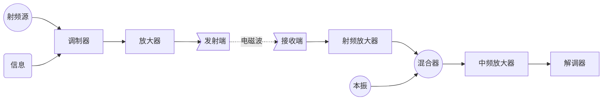

前言
-------------

什么是射频？

> 射频（Radio Frequency，简称RF）指的是电磁波谱中的一部分，通常指频率范围在1GHz到300GHz之间的电磁波，包括UHF（超高频）、SHF（超级高频）和EHF（极高频）频段，这些频段广泛应用于现代通信系统，如移动电话、卫星通信和雷达。    
通信：微波频段支持移动电话网络、卫星通信和Wi-Fi等。     
雷达：用于交通控制、导航和速度测量。    
工业：微波炉和工业加热。     
科学：通过射电天文学研究宇宙射线。  

射频设备和电路的设计非常注重信号的稳定性和传输效率，通常需要特定的技术来减少信号的损耗和干扰。

## 一、射频理论基础

### 1.1 微波

微波：波长<0.5m

波长简单来说就是波在介质种完成一个完整周期所需的长度

微波的波长（λ）、频率（f）和光速（c）之间的关系可以通过以下公式表示：

波长公式：

$$λ=\frac{c}{f}$$  

其中：
    λ 是波长，单位为米（m）
    f 是频率，单位为赫兹（Hz）
    c 是光速 3×10^8m/s

频率越高，波长越短，这就解释了为什么在高频率下，传统的电阻等元件会表现出不同的特性。例如，在微波频率下，电阻的引线可能表现为电感性，这是由于趋肤效应的影响。表面效应是指高频信号在导体的外层传播，导致能量集中在导体的表面，增加了电感性反应。

### 1.2 微波系统基本框图

## 二、常用射频和微波术语

### 2.1 分贝（dB）：

分贝（dB）是一个对数单位，用于表示功率或电压的比率。功率的分贝表示为： 

$$dB=10\log_{10}\left(\frac{P_{2}}{P_{1}}\right)$$

其中 $P_{2}$ 和 $P_{1}$ 是功率值，单位为瓦特。

在电压的情况下，分贝表示为：

$$dB=20\log_{10}\left(\frac{V_{2}}{V_{1}}\right)$$

3dB的变化表示功率的加倍或减半，10dB的变化表示功率的10倍变化。

### 2.2 反射系数（Γ）：

反射系数描述了传输线与负载之间的阻抗不匹配时的反射情况。其定义为反射电压与入射电压的比值：

$$\Gamma=\frac{Z_{L}-Z_{0}}{Z_{L}+Z_{0}}$$

其中$Z_{L}$是负载阻抗，$Z_{0}$是传输线的特性阻抗。

### 2.3 其他常用术语与缩略语

缩略语|名称|
-:|:-|
PAD         |20dB功率衰减器(Power Attenuator Device)|
CW          |常数波（Constant Wave）|
VSWR        |电压驻波比(Voltage Standing Wave Ratio)|
RL          |回波损耗（Return Loss）|
VNA         |矢量网络分析仪(Vector Network Analyzer)
FFT         |快速傅里叶变换(Fast Fourier Transform)
RF          |无线电频率（Radio Frenquency）
IF          |中频(Intermediate Frenquency)
LO          |本振（Local Oscillator）
LPF         |低通滤波器（Low Pass Filter）
HPF         |高通滤波器（High Pass Filter）
BPF         |带通滤波器(Band Pass Filter)
BW          |带宽（Bandwidth）
DSP         |数字信号处理(Digital Signal Processing)
LNA         |低噪声放大器(Low Noise Amplifier)，提高期望的信号电平，同时贡献最小的噪声
SNR         |信噪比(Signal to Noise Ratio)
PLL         |锁相环(Phase Locked Loop)
OSLT        |开短载通
open circuit     |开路
short circuit    |短路
load circuit     |载路
through circuit  |通路
OFDM        |正交频分多路复用（Orthogonal Frequency Division Multiplexing）
VCO         |压控晶振(电压控制晶振)(Voltage Controlled Oscillator)
DIB         |设备接口板(Device Interface Board)
DPD         |数字预失真矫正（Digital predistortion）
DUT         |待测试设备（Device Under Test）
ECAL        |电子校准（Electroinc Calibration）
ISI         |符号间干扰(Intersysmbol Interference)
ACP         |邻道功率（Adjacent Channel Power）
SEM         |频谱杂散模板（Spectral Emission Mask ）
ACPR        |邻道功率抑制比（Adjacent Channel Power Rejection）
IMD         |交调失真(Intermodulation Distortion)
RFSA        |射频信号分析仪（Radio Frequency Signal Analyzer）
RFSG        |射频信号发生器（Radio Frequency Signal Generator）
ASK         |振幅移位键控（Amplitude Shift Keying）
FSK         |频率移位键控（Frequency Shift Keying）
PSK         |相位位移键控（Phase Shift Keying）
QPSK        |正交相位位移键控（Quadrature Phase Shift Keying）
8-PSK       |8进制相位位移键控（8-ary Phase Shift Keying）
AM          |幅值调制（Amplitude Modulation）
FM          |频率调制（Frequency Modulation）
PM          |相位调制（Phase Modulation）
AMPM        |幅值调制转相位调制（AM to PM）
QAM         |正交调幅（Quadrature Amplitude Modulation）
BER         |位误码率（Bit Error Rate）
EVM         |错误矢量幅度（Error Vector Magnitude）
BERT        |位误码测试仪（Bit Error Rate Tester）
RRC Filter  |根升余弦滤波器（Root Raised Cosine Filter）
|
**术语**|**名称**
Phase Noise                 |相位噪声
Harmonic Distortion         |谐波失真
Occupied Bandwidth          |所占带宽
Power in Band               |带内功率
Baseband Filter             |基带滤波器
Modulated Source            |调制源
Intermodulation             |交调
Power De-embedding          |功率去嵌入
Input Impedance/Return Loss |输入阻抗/回波损耗
Gain/Power level            |增益/功率级
1dB Compression             |1分贝压缩点（用于测量待测设备的线性度）
IP2                         |2阶交调截取点
IP3                         |3阶交调截取点
Noise Factor                |噪声系数
VCO Tuning Range            |压控晶振(电压控制晶振)调谐范围
Settling Time               |建立时间
Sensitivity test            |灵敏度测试
Spectrum Analyzers          |频谱分析仪
Constellation Diagram       |星座图
Eye Diagram                 |眼图
RF Torque Wrench            |射频扭力扳手
RF Mixer                    |射频混频器（下变频是将RF射频信号与LO本振信号混合后转换为IF中频信号）
Smith Chart                 |史密斯圆图
S-Parameter                 |散射参数
   
## 三、传输线理论

什么是传输线？

传输线是信号或功率从一个点传输到另一个点的媒介。常见的传输线有同轴电缆、微带线和条形线。

在高频情况下，传输线有其特征阻抗（$Z_{0}$），可以通过单位长度的系列电阻（R）、电感（L）、电容（C）和导电（G）等参数来描述。

驻波与电压驻波比：
当负载阻抗与传输线的特性阻抗不匹配时，会产生反射，形成驻波。**电压驻波比**（VSWR）是衡量反射的一个指标，计算公式为：

$$VSWR=\frac{1+\lvert\Gamma\rvert}{1-\lvert\Gamma\rvert}$$

其中，Γ是反射系数。VSWR为1表示完美匹配（无反射），较高的值则表示不匹配。

## 四、S参数

什么是S参数？

散射参数（S参数）用于描述高频电路的行为，特别适用于射频网络。S参数有助于表征如放大器、滤波器和天线等元件。常见的二端口网路S参数包括：
    S11 和 S22：表示输入和输出端口的反射。
    S21：表示信号通过设备的增益（正向传输）。
    S12：表示反向传输的隔离性。

当波形沿着一个方向传播时， 入射波的能量被传输线或电路反射/散射，这样导致入射波的能量被分解成各种方向的波的能量，S-Parameter就是这样一个基于入射波，反射波以及透射波三者关系的一个基本概念

**史密斯圆图**（Smith Chart）常用于可视化S参数和解决阻抗匹配等问题。

## 五、功率测量

峰值功率与RMS功率：

功率与电压的平方成正比（除以阻抗）：

$$P=\frac{V^2}{R} $$

对于时变信号，使用**均方根**（RMS）功率来表示其"直流等效"值，并代表信号传递的功率。

## 六、调制

### 6.1 调制技术类型

Technology and Modulation Type  
    Radio, mobile phones (1G): AM, FM   
    Mobile GSM/DCS (2G): GMSK   
    Mobile EDGE (2.5G): 8-PSK   
    Mobile W-CDMA (3G): HPSK    
    Mobile LTE Advanced (4G): QPSK, 16-QAM  
    Mobile LTE Advanced (4G): QPSK, 16-QAM  
    Cordless phones DECT: GFSK  
    WLAN: OFDM  
    Bluetooth: GFSK 
    GPS: BPSK   

## 七、总结
微波和射频技术是现代通信系统、雷达以及各类工业应用的基础。理解诸如分贝、传输线理论、S参数等关键概念对于设计和优化这些系统至关重要。使用工具如史密斯图，工程师可以分析和优化射频元件，确保功率传输的效率和最小的信号损失。