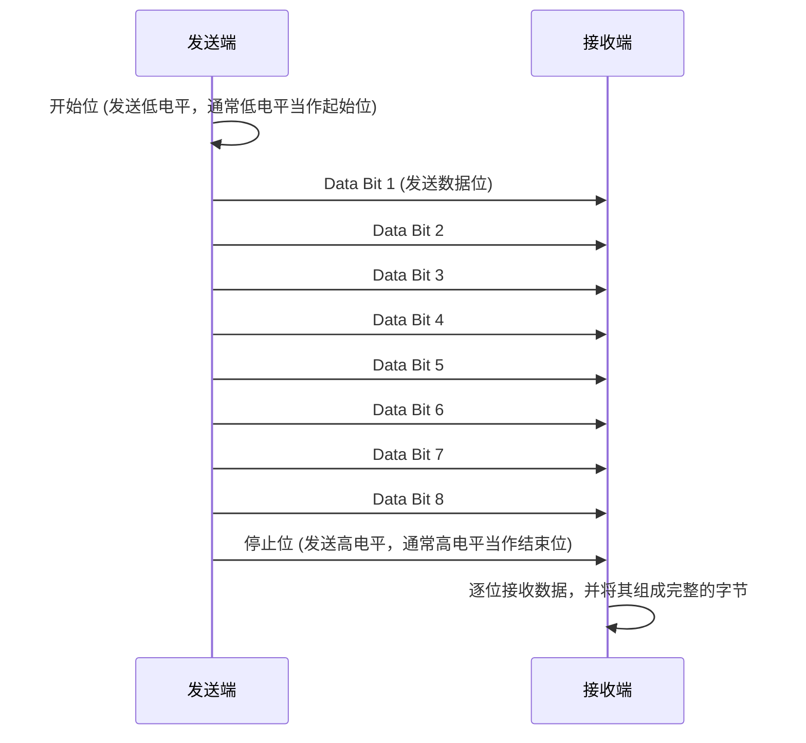
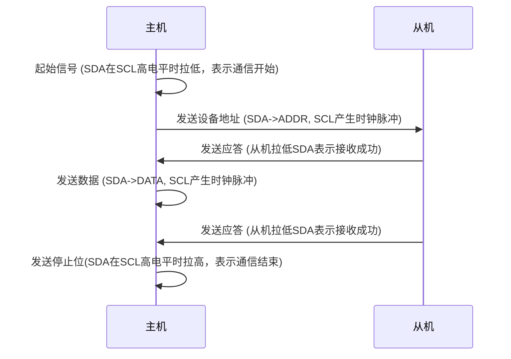
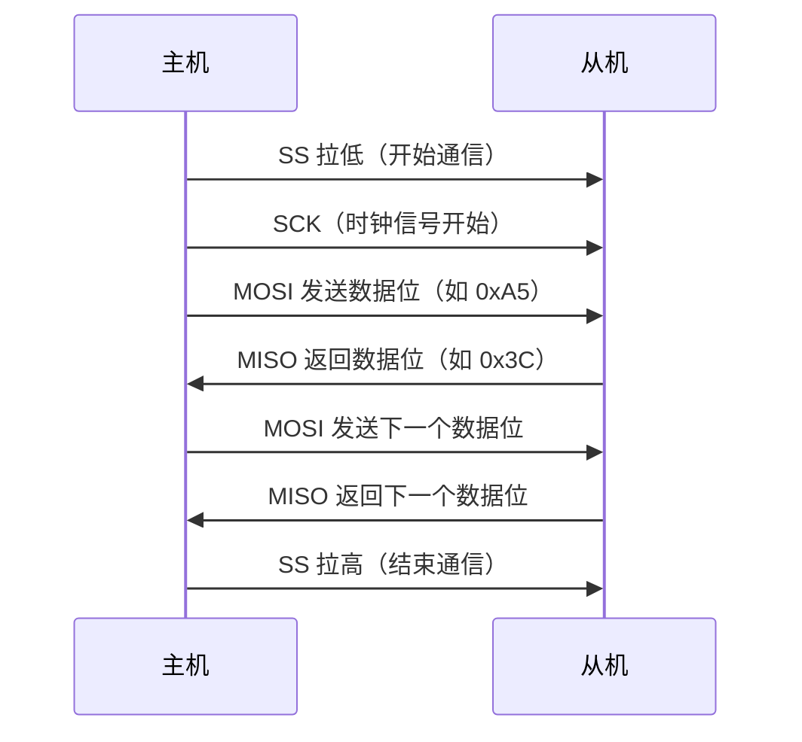
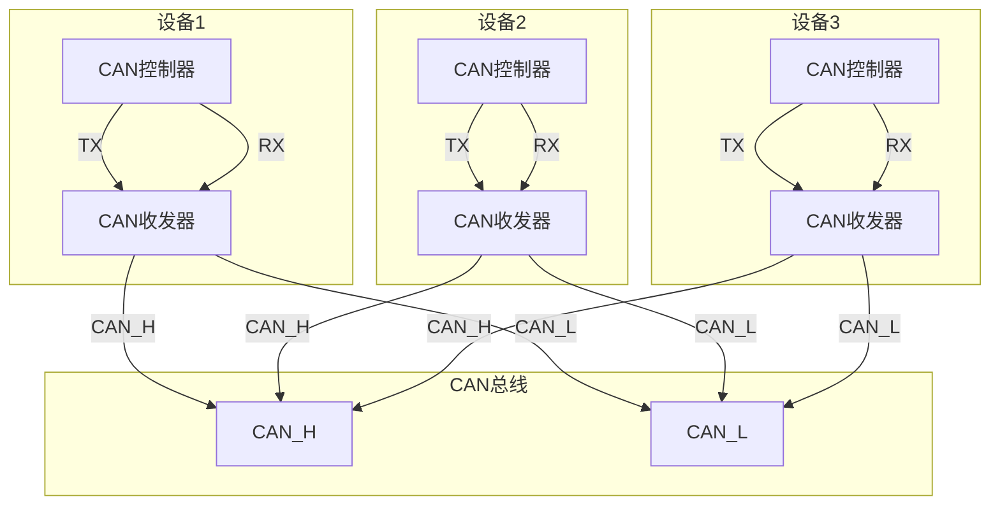
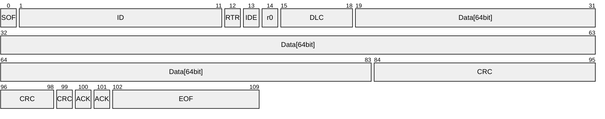

说到通信协议，HTPP、TCP/IP张口就来，这是如今网络通信的基石；
但是如今嵌入式系统中也通信协议也数不胜数，UART、I2C、SPI、USB、CAN、PCIe这类是常用的有线通信协议，当然也有无线通信协议Bluetooth、WiFi、ZigBee等；

    
    <table border="1">
    <tr>
        <th>特性</th>
        <th>UART</th>
        <th>I2C</th>
        <th>SPI</th>
        <th>USB</th>
        <th>CAN</th>
        <th>PCIe</th>
    </tr>
    <tr>
        <td>通信方式</td>
        <td>异步串行</td>
        <td>同步串行</td>
        <td>同步串行</td>
        <td>串行总线</td>
        <td>多主总线</td>
        <td>点对点串行</td>
    </tr>
    <tr>
        <td>数据方向</td>
        <td>半双工/全双工</td>
        <td>半双工</td>
        <td>全双工</td>
        <td>全双工</td>
        <td>半双工</td>
        <td>全双工</td>
    </tr>
    <tr>
        <td>信号线数</td>
        <td>2（TX、RX）</td>
        <td>2（SCL、SDA）</td>
        <td>4（SCK、MOSI、MISO、SS）</td>
        <td>2（D+、D-）</td>
        <td>2（CANH、CANL）</td>
        <td>2N（双向Lane对）</td>
    </tr>
    <tr>
        <td>速率范围</td>
        <td>110bps~1Mbps</td>
        <td>100Kbps~3.4Mbps</td>
        <td>几Mbps~几十Mbps</td>
        <td>1.5Mbps~5Gbps+</td>
        <td>125Kbps~5Mbps</td>
        <td>2.5GT/s~128GT/s</td>
    </tr>
    <tr>
        <td>多设备支持</td>
        <td>不支持</td>
        <td>支持</td>
        <td>支持（需多个SS）</td>
        <td>支持</td>
        <td>支持</td>
        <td>支持</td>
    </tr>
    <tr>
        <td>控制方式</td>
        <td>无主从</td>
        <td>主从</td>
        <td>主从</td>
        <td>主从</td>
        <td>多主多从</td>
        <td>主从</td>
    </tr>
    <tr>
        <td>通信距离</td>
        <td>短</td>
        <td>短</td>
        <td>短</td>
        <td>中等</td>
        <td>中远</td>
        <td>短</td>
    </tr>
    <tr>
        <td>抗干扰性</td>
        <td>一般</td>
        <td>一般</td>
        <td>一般</td>
        <td>中等</td>
        <td>强</td>
        <td>一般</td>
    </tr>
    <tr>
        <td>应用场景</td>
        <td>MCU、传感器</td>
        <td>EEPROM、传感器</td>
        <td>Flash、显示屏</td>
        <td>键盘、U盘、摄像头</td>
        <td>汽车、工业自动化</td>
        <td>显卡、SSD、扩展卡</td>
    </tr>
    </table>

## 一、UART

UART（Universal Asynchronous Receiver/Transmitter，通用异步收发传输器）即常说的串口。

特点：
- 异步通信：不需要共享时钟信号；
- 点对点连接：通常是一对设备直接通信；
- 全双工通信：独立的发送（TX）和接收（RX）线路，**可同时发送和接收数据**；
- 简单协议：只需要少量的引脚和基本配置即可通信；
- 速度有限：通常低于 1 Mbps；

UART通常使用两根信号线：TX（Transmit）：发送端口，负责将数据发送出去。RX（Receive）：接收端口，负责接收数据。

为了实现通信，设备之间需要交叉连接，另外，为了提升通信可靠性，有时会加上地线确保两个设备有共同的电位参考。

### 1.1 UART工作原理

UART使用异步方式进行数据传输，这意味着它不需要共享时钟，而是依赖双方约定好的波特率（Baud Rate，1秒内传送bit的数量）来同步数据。只要波特率相同，一般就可正常解析数据。

在使用过程中，我们可以直接配置GPIO复用使用硬件UART资源，当硬件资源不够时通过软件模拟串口实现，当然软件模拟串口有一定的局限性。

### 1.2 UART的基本通信过程

### 1.3 UART应用场景

- 设备调试和日志输出（如串口调试工具）；
- MCU（微控制器）之间的数据交换；
- 外设通信（如 GPS 模块、蓝牙模块、Wi-Fi 模块）；
- 传感器数据采集；
- 嵌入式系统的固件升级（如通过串口烧录程序）；

### 1.4 USART

带时钟信号（SCK）的串口通信，可以实现同步模式，不过通常都用异步模式。

特点：
- 共享时钟：发送和接收的数据会根据时钟信号的上升或下降沿来确定；
- 不需要波特率同步：由于时钟线同步数据，接收端可以不依赖波特率来确定接收时机；
- 高数据传输速率：同步模式通常比异步模式具有更高的可靠性和更快的传输速度；

特性|异步模式（UART）|同步模式（USART）
-:|:-:|:-:
**时钟线**|无|有（SCK）
**数据线**|TX、RX|TX、RX
**数据传输方式**|基于波特率同步|基于时钟信号同步
**应用场景**|常规串口通信|更高速地数据传输

### 1.5 TTL/RS232/RS485通信标准

他们是一种常见的串行通信标准。它定义了串行通信的电气特性，如电平、接线等。

**TTL（Transistor-Transistor Logic）：**
- 是一种电平标准；
- 逻辑“0”：在 TTL 中，逻辑“0”通常对应 0V 到 0.8V 的电压范围。也就是低电平；
- 逻辑“1”：逻辑“1”通常对应 2V 到 5V 的电压范围。也就是高电平；
- 抗干扰能力弱；

**RS232（Recommended Standard 232）：**
- RS232使用负电平和正电平来表示逻辑“0”和“1”；
- 逻辑“0”表示-12V，通常对应-3V到-15V的电压范围；
- 逻辑“1”表示+12V，通常对应3V到15V的电压范围；
- 接口连接具有多根信号线，包括TX、RX、RTS（请求发送）、CTS（清除发送）等；
- RS232 的有效传输距离一般较短（通常为15米以内）；
- 抗干扰能力较TTL有所增强；

**RS485（Recommended Standard 485）：**
- RS485使用差分信号来传输数据，通过 A（+） 和 B（-） 两根信号线传输数据，具有更强的抗干扰能力和更远的通信距离；
- 逻辑“0”表示信号A小于信号B；
- 逻辑“1”表示信号A大于信号B；
- 多点通信：支持多点通信（即多个设备共享同一条总线），最多可以连接 32 个设备；
- 通信距离：RS485 能够支持更长的通信距离（通常为 1200 米）和更高的传输速率（最高可达 10 Mbps）；
- 使用双绞线由两根相互绝缘的导线相互缠绕而成，特别适合差分信号传输场合，与平行线相比，可以更有效地抑制干扰；

特性|UART|RS232|RS485
-:|:-:|:-:|:-:
**传输方式**|异步串行通信|异步串行通信|差分串行通信
**电平标准**|TTL(0~5V)|正负电压（±12V 或 ±5V）|差分电压（A 和 B 信号线）
**支持设备数量**|1 对 1（点对点通信）|1 对 1（点对点通信）|多点通信（最大 32 个设备）
**通信模式**|全双工|全双工|半双工（可通过额外线缆支持全双工）
**最大距离**|通常较短（几米到几十米）|最长 15 米|最长 1200 米
**应用场景**|常见于计算机串口|计算机串口、POS、打印机|工业自动化、仪表控制

TTL、RS232和RS485电平标准不同，通常需要通过电平转换器来实现它们之间的互通。常用的MAX232（RS232 转 TTL 转换器）或 RS485转TTL转换器来进行电平转换和实现不同设备之间的通信。

## 二、I2C

I2C（Inter-Integrated Circuit，一种内部芯片之间的通信），是一种高效的双线通信协议，是一种低成本、简单、可靠的短距离通信。它解决了硬件复杂、设备寻址、多设备管理等问题，广泛用于传感器、存储设备、显示屏等外围设备与MCU的通信的场景。

I2C通常使用两根信号线：SCL（时钟线）、SDA（数据线），以及地线、3.3V。此外，SCL和SDA都是开漏设计，需要接上拉电阻，拉到高平。

特点：
- 简单的双线通信：SCL（时钟线）、SDA（数据线），简化硬件连接和PCB布线；
- 支持**多主多从**模式，设计使用7位或10位设备地址码，同一总线上可以连接多个从设备，通过地址区分；防止多个主设备同时操作总线引发冲突，需要引入总线仲裁；
- 双向，半双工通信协议；
- 多速率支持（100kHz、400kHz、3.4MHz）；
- 应答机制，ACK/NACK 应答机制，每个字节传输后需接收方确认（ACK）；
- 采用TTL电平；

### 2.1 I2C工作原理

I2C由时钟线和数据线共同作用，来实现信号的发送接收:
- 数据传输是通过在SCL线的时钟脉冲引导下进行的。每次时钟脉冲时，SDA线上会传输一个数据位；
- 逻辑“1”：SCL一次脉冲，SDA高电平；逻辑“0”：SCL一次脉冲，SDA低电平；
- 起始信号定义：在SCL高电平期间，SDA从高电平跳变为低电平，表示I2C通信开始；
- 停止信号定义：在SCL高电平期间，SDA从低电平跳变为高电平，表示I2C通信结束；
- ACK（应答，确认信号）：接收方在接收每个字节后，拉低SDA，表示成功接收数据；
- NACK（非应答）：接收方在接收数据后，保持SDA高电平，表示未成功接收数据或不需要更多数据；

### 2.2 I2C的基本通信过程

像STM32部分GPIO有配置I2C硬件资源，硬件模块会自动处理大部分时序，大大简化了I2C通信的实现，开发者只需要配置相应的参数（如时钟速度、I2C模式等），然后就可以使用简单的API进行数据传输。

当然也可以在STM32上模拟I2C通信（即使用软件模拟I2C）这种方法并不依赖于硬件I2C模块，而是通过GPIO引脚手动控制时钟（SCL）和数据（SDA）线的电平变化来模拟I2C的时序。

## 三、SPI

SPI（Serial Peripheral Interface，串行外围设备接口），与I2C和UART相比，SPI在速度和灵活性方面具有优势，因此适合用于高速数据传输的应用。

特点：
- 全双工通信，主设备通过MOSI线发送数据，同时接收来自从设备的数据（通过MISO线）；
- SPI是同步时钟，所有数据的传输都由主设备生成的时钟信号（SCK）来同步；
- 支持一主多从，主设备通过控制每个从设备的SS线来选择通信对象(因此不需要设备地址)，不过这样的化，每增加一个从设备，都需要额外的SS线，这会占用更多的GPIO引脚；
- SPI支持更高的数据传输速率，速度可以根据时钟频率和传输位宽来调节，常见速率可以达到几十Mbps;
- 有四种工作模式；
- 可调节的传输位宽；
- 不支持错误检测，依赖硬件可靠性，或者协议上的设计（CRC校验）来保证数据可靠；

SPI协议是一种主从式通信协议，其中一个设备（主设备）控制通信过程，而其他设备（从设备）响应主设备的请求。SPI使用四根线来传输数据：
- MOSI(Master Out Slave In，主设备发送数据线)；
- MISO(Master In Slave Out，主设备接收数据线)；
- SCK(Serial Clock，时钟线)；
- SS(Slave Select，时钟线)；
- 当然这里还需要需要电源和共参考的地线；

### 3.1 SPI工作原理

- 主设备选择从设备：通过控制SS线来选择一个特定的从设备。选择的方式是将SS线拉低；
- 时钟信号同步：主设备通过SCK线提供时钟信号，所有设备都会根据时钟信号来同步数据传输。数据在时钟的上升沿或下降沿被捕捉，取决于SPI的模式设置；
- 数据传输：数据从主设备通过MOSI线发送到从设备，从设备通过MISO线返回数据到主设备；
- 结束通信：主设备通过将SS线拉高来停止与从设备的通信，表示当前数据传输结束；

SPI协议支持多种工作模式，，这些模式的主要区别在于时钟极性（CPOL）和时钟相位（CPHA）的不同设置。两者决定了数据传输的时序：
- CPOL（Clock Polarity）：控制时钟信号的空闲状态（高电平或低电平）。如果CPOL为0，则时钟在空闲时为低电平；如果CPOL为1，则时钟在空闲时为高电平；
- CPHA（Clock Phase）：控制数据的采样时刻。CPHA决定了数据在时钟的哪个边沿被采样（上升沿或下降沿）；

SPI有四种常见模式，分别由CPOL和CPHA的不同组合产生：
- 模式0：CPOL=0, CPHA=0（时钟空闲时低，数据在时钟的上升沿采样）；
- 模式1：CPOL=0, CPHA=1（时钟空闲时低，数据在时钟的下降沿采样）；
- 模式2：CPOL=1, CPHA=0（时钟空闲时高，数据在时钟的上升沿采样）；
- 模式3：CPOL=1, CPHA=1（时钟空闲时高，数据在时钟的下降沿采样）；

选择正确的SPI模式非常重要，它必须与从设备的SPI设置兼容。

### 3.2 SPI的基本通信过程

## 三、USB

USB（Universal Serial Bus）技术自问世以来，经历了多次重大升级，不断满足日益增长的数据传输和供电需求。从USB2.0、USB3.0和Type-C，带来了显著的性能提升

USB 2.0于2000年发布，最大传输速率480Mbps，是USB 1.1的40倍。它采用半双工通信方式，使用4线制连接（VBUS、D+、D-、GND）。供电能力方面，USB 2.0可提供最大500mA电流。

USB3.0于2008年发布，理论传输速率达到5Gbps。它采用全双工通信，新增了5个触点（2对差分信号线和1根地线）。供电能力提升至900mA，后续的USB 3.1更支持最大3A电流。

USB Type-C于2014年发布，是USB接口的物理形态革新。它采用24针对称设计，支持正反插拔。Type-C接口整合了USB 3.1、DisplayPort、Thunderbolt等多种协议，最大传输速率可达40Gbps（USB4）。

### 3.1 USB工作原理

USB相较于传统的通信方式要复杂的多，主要基于D+、D-两根差分信号线配合来传输数据，当D+高于D-时，表示逻辑高；当D+低于D-时，表示逻辑低。

协议层机制要复杂的多，目前没有实用场景，所以将来如果用到了再深入学习吧。

## 四、CAN

CAN（Controller Area Network）总线是一种广泛应用于工业控制和汽车电子领域的现场总线技术。

特点：
- 差分信号传输，最大距离可达10km；
- 支持多主架构，通信速率可配置，最高可达1Mbps；
- 节点可热插拔；
- 异步，半双工通信；
- 可实现广播式、请求式两种通信方式；

仅需要两跟信号线（CAN_H、CAN_L），无需共地；

### 3.1 CAN工作原理

硬件电路包含CAN总线上的设备，需要包含CAN控制器、CAN收发器

CAN总线采用差分信号传输，电平状态由CAN_H和CAN_L的电压差决定。显性电平（Dominant）表示逻辑0，CAN_H约为3.5V，CAN_L约为1.5V，电压差约为2V。隐性电平（Recessive）表示逻辑1，CAN_H和CAN_L均为2.5V，电压差为0V。

这里隐性是指默认状态，两线没有压差；反之亦然。

标准数据帧格式：

- 0: SOF（Start of Frame）：第 0 位，1 位显性电平（逻辑 0），标志帧的开始。
- 1-11: 标识符（Identifier）：第 1-11 位，表示消息的优先级和内容。
- 12-15: 控制字段（Control Field）：
- 12: RTR（Remote Transmission Request）：1 位显性电平（逻辑 0），表示数据帧；隐性电平（逻辑 1）表示远程帧。
- 13: IDE（Identifier Extension Bit）：1 位显性电平（逻辑 0），表示标准帧；隐性电平（逻辑 1）表示扩展帧。
- 14: r0（Reserved Bit）：1 位显性电平（逻辑 0），保留位。
- 15-18: DLC（Data Length Code）：4 位，表示数据场的字节数（0-8 字节）。
- 19-XX: 数据场（Data Field）：从第 19 位开始，长度为 0-8 字节，实际传输的数据。
- XX+1-XX+15: CRC（Cyclic Redundancy Check）：15 位 CRC 校验码，用于错误检测。
- XX+16: CRC界定符（CRC Delimiter）：1 位隐性电平（逻辑 1），标志 CRC 字段结束。
- XX+17: ACK槽（ACK Slot）：1 位隐性电平（逻辑 1），发送节点发送，等待接收节点确认。
- XX+17: ACK（Acknowledge）：1 位显性电平（逻辑 0），接收节点发送，确认接收成功。
- XX+18: ACK界定符（ACK Delimiter）：1 位隐性电平（逻辑 1），标志 ACK 字段结束。
- XX+19-XX+25: EOF（End of Frame）：7 位隐性电平（逻辑 1），标志帧的结束。