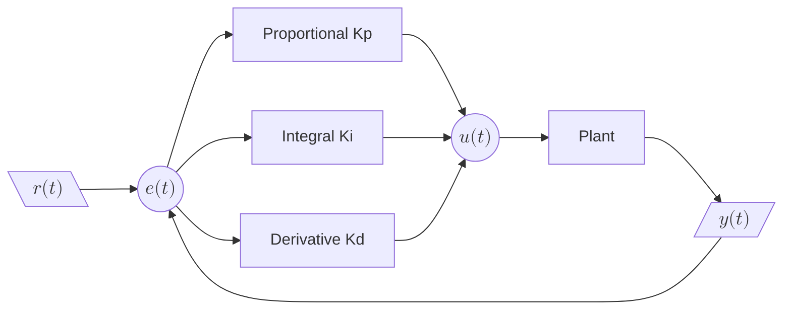

提到PID，做控制的各位都是经常接触。本章针对PID的定义、应用进行归纳和整理。主要参考《电动机的单片机控制》[^1]，PID控制器一章内容学习总结。

核心思想总结：
- 比例项 P：看的是 “现在差多少”，提供即时反应。
- 微分项 D：看的是 “变化有多快”，提供阻尼和预测。
- 积分项 I：看的是 “差了多久，总共差了多少”，致力于纠正那些小而持久的偏差。

## 1. 模拟PID控制原理

PID控制有基本要件：
- 比例(proportional)、积分(integral)、微分(derivative)。
- PID采集周期（循环周期）也是闭环系统的重要参数，因为有些时候传感器离执行器较远，过程变量改变和观测到该改变之间的时间延迟，也就是不响应期

PID控制系统的原理图:


_**说明**_
- $ r(t) $ 为输入值；
- $ y(t) $ 为输出值；
- $ e(t) $ 为每一次运行后的误差 $ e(t) = r(t)  - y(t) $；
- Plant被控对象，通常是电机之类的设备；
- mermaind画出来的真丑；

根据PID控制系统的原理图，容易得出控制器控制规律：

$$
u(t) = K_p \left[ e(t) + \frac{1}{T_i} \int_0^t e(t)\,dt + T_d \frac{d e(t)}{dt} \right] + u_0
\tag{1}
$$

_**式中**_
- $ u(t) $ 控制器输出；
- $ K_p $ 是比例系数；
- $ T_i $ 是积分常数；
- $ T_d $ 微分常数；
- $ e(t) $ 是当前时刻的误差；
- $ u_0 $ 控制常量，是在无误差时仍需要维持输出的那部分“基础控制量”，它是 PID 控制器中的一个静态偏置，保证系统能在稳态持续运转；

简单来说，PID控制器各环节作用如下：
1. 比例环节仅仅取决于设定值和过程变量之间的差值。这个差值被称为“误差”。比例增益决定了输出响应对误差信号的比例。例如，错误项的误差幅值为10，比例增益为5，这将产生比例响应为50。一般情况下，增加比例增益将提高控制系统响应的速度。但是，如果比例增益太大，过程变量会出现振荡。如果继续增加，系统振荡会越来越大，使得系统变得不稳定，以至于失控。
1. 积分环节将一段时间内的误差相加。即使是一个很小的误差，也会让积分响应缓慢增加。积分响应会根据时间持续增加，除非误差为0。因此，积分响应的目的在于将稳定状态的误差保持在0。稳定状态误差是过程变量和设定值之间的差值。当积分操作满足了控制器的条件，而控制器还未将误差保持在0时，会产生一种称为积分饱和的现象。
1. 如果过程变量快速增加，微分分量会导致输出减少。微分响应与过程变量的变化率之间成比例关系。增加微分时间$ T_d $会使控制系统对误差的反应更加剧烈，也会增加整个控制系统的响应时间。大多数实用控制系统使用非常小的微分时间$ T_d $，因为微分响应对过程变量的噪声特别敏感。如传感器反馈信号中有噪声或控制循环速率太低，微分响应会使控制系统变得不稳定。

以上是模拟PID的控制原理，并不能实际作用于我们的单片机控制系统，因为单片机是一种采样控制，只能能根据采样时刻的偏差值计算控制量，所以需要采用离散化的方法。

## 2. 数字PID控制算法

数字PID控制算法可分为位置式PID控制算法和增量式PID控制算法

位置式PID控制算法和增量式PID控制算法之间存在密切的关系，可以通过增量式算法推导出位置式的递推公式。

### 2.1. 位置式PID控制算法

离散化：指将连续特征或者变量，转变成离散特征或者变量的过程。此处离散化处理方法为以T作为采样周期，$ k $ 作为采样序号，则采样连续时间$ t $可以用$ kT $代替，用求和的形式代替积分，用增量的形式代替微分；

可作如下近似变换：

$$
\begin{cases}
t \approx kT \quad (k = 0,1,2,\cdots) \\
\int_{0}^{t} e(t)  dt \approx T \sum_{j=0}^{k} e(jT) = T \sum_{j=0}^{k} e_j \\
\frac{de(t)}{dt} \approx \frac{e(kT) - e[(k-1)T]}{T} = \frac{e_k - e_{k-1}}{T}
\end{cases}
\tag{2}
$$

将式（2）带入式（1），就可以得到离散化的PID表达式：

$$
u_k = K_p \left[ e_k + \frac{T}{T_i} \sum_{j=0}^{k} e_j + \frac{T_d}{T} (e_k - e_{k-1}) \right] + u_0
\tag{3}
$$

或，进一步简化为：

$$
u_k = K_p e_k + K_i \sum_{j=0}^{k} e_j + K_d (e_k - e_{k-1}) + u_0
\tag{4}
$$

_**式中**_
- $ K_p $ 是比例增益；
- $ K_i $ 是积分增益，$ K_i = K_p \frac{T}{T_i}$；
- $ K_d $ 是微分增益，$ K_d = K_p \frac{T_d}{T}$；
- $ e_k $ 是当前时刻的误差；
- $ \sum_{j=0}^{k} e_j $ 是误差的累加和。

因为直接由式（1）得出，每一次计算都给出了全部的控制量，故称为全量式或位置式。

### 2.2. 位置式PID的意义

积分完整，理论上可完全消除静态误差。

这种算法的缺点是：由于全量输出，所以每次输出均与过去状态有关，计算时要对$ e_k $累加，工作量大（其实对于现代计算机来说并不算什么）；并且因为计算输出的$ u_k $是实际位置，如果计算错误，则会引起输出大幅度变化，从而易产生事故；更有可能的问题在于计算的溢出（随着系统长时间运行，积分项快速累积，理论上就是无限大，实际上我们可以做一些限幅）、精度丢失（在浮点数运算中，当一个非常大的数加上一个非常小的数时，小数的精度可能会丢失）。

### 2.3. 增量式PID控制算法

所谓增量是指控制器的输出只是控制量的增量$ \Delta u_k $，位置式的输出$ u_k $可以表示为上一次的输出$ u_{k-1} $加上当前的增量$ \Delta u_k $：

$$
u_k = u_{k-1} + \Delta u_k
\tag{5}
$$

那么$ u_{k-1} $，可由式（3）推到出：

$$
u_{k-1} = K_p \left[ e_{k-1} + \frac{T}{T_i} \sum_{j=0}^{k-1} e_j + \frac{T_d}{T} (e_{k-1} - e_{k-2}) \right] + u_0
\tag{6}
$$

将式（3）与式（6）相减，即可得到增量式PID的输出$ \Delta u_k $，其表示控制量的变化量，其公式为：

$$
\begin{align}
\Delta u_k &= u_k - u_{k-1} \tag{7} \\
&= K_p \left[e_k - e_{k-1} + \frac{T}{T_i} e_k + \frac{T_d}{T} (e_k - 2e_{k-1} + e_{k-2}) \right] \tag{8} \\
&= K_p (e_k - e_{k-1}) + K_i e_k + K_d (e_k - 2e_{k-1} + e_{k-2}) \tag{9} \\
\end{align}
$$

_**式中**_
- $ K_p $ 是比例增益；
- $ K_i $ 是积分增益，$ K_i = K_p \frac{T}{T_i} $；
- $ K_d $ 是微分增益，$ K_d = K_p \frac{T_d}{T} $；

或，上式（8）也可以写成下面形式：

$$
\begin{align}
&= K_p (1 + \frac{T}{T_i} + \frac{T_d}{T}) e_k - K_p (1 + \frac{2T_d}{T}) e_{k-1} + K_p \frac{T_d}{T} e_{k-2} \tag{10} \\
&= A e_k + B e_{k-1} + C e_{k-2} \tag{11}
\end{align}
$$

_**式中**_
- $ A = K_p (1 + \frac{T}{T_i} + \frac{T_d}{T}) $
- $ B = - K_p (1 + \frac{2T_d}{T}) $
- $ C = K_p \frac{T_d}{T}  $
- 若带入$ K_i = K_p \frac{T}{T_i} $、$ K_d = K_p \frac{T_d}{T} $，即
    - $ A = K_p + K_i + K_d $
    - $ B = -K_p - 2K_d $
    - $ C = K_d $

**Q: 为什么会有式（11）这种形式的公式？**<br>
**A:** 这种形式的意义在于：实现简单，只需存储最近两个误差值；在微处理器中编程非常方便，只需三次乘法和两次加法。
​
### 2.3. 增量式PID的意义

通过递推公式简化了实现过程，同时保持了控制算法的完整性。并且避免直接计算误差的累加和$ \sum_{j=0}^{k} e_j $，从而减少计算量和内存占用。每次只需保存上一次的输出$ u_{k-1} $ 和最近的几次误差值$ e_k, e_{k-1}, e_{k-2} $，即可完成计算。因为输出是增量，一旦输出达到限幅，它就会停止增长，不会出现巨大的积分累积。系统反应更安全。

这种算法的缺点是：积分作用可能偏弱$ Ki * e(k) $只与当前误差有关。

### 2.5. PID整定

设置P、I、D最佳增益，从而得到控制系统理想反馈的过程叫做整定。 PID整定方法有很多种。学习整理了一下手动整定和Ziegler Nichols整定方法。

手动整定方法：
1. 先比例，后积分，再微分。
1. 只使用P控制（将Ki和Kd设为0），从小到大逐渐增大Kp，直到系统出现持续、等幅的振荡。此时系统的响应速度最快，但无法稳定，记录当前P值。
1. 加入积分控制（PI控制），在P控制稳定的基础上，引入积分。先将Kp设为之前临界增益的一半，从小到大逐渐增大Ki。积分作用会开始消除静差，但也会引起系统再次振荡。调整Ki，直到系统在快速消除静差和保持稳定之间取得平衡，记录当前I值。
1. 加入微分控制（PID控制）如果系统经过PI调节后，响应速度仍然不够快，或者超调过大，可以引入微分。保持Kp和Ki不变，从小到大逐渐增大Kd。微分作用会抑制振荡，使系统更稳定，响应曲线更平滑。但Kd过大容易引入高频噪声。

ZN整定法-临界比例度法：
1. 同样在手动整定的步骤1的基础上，纯P控制，直到系统出现持续、等幅的振荡。记录下此时的Kp值，称为临界增益（Ku），以及振荡的周期，称为临界周期（Tu）。
1. 然后根据控制器类型，使用下表公式计算参数：

| 控制器类型 | Kp | Ti | Ki | Td | Kd |
| :--- | :--- | :--- | :--- | :--- | :--- |
| **P** | 0.50 Kᵤ | — | — | — | — |
| **PI** | 0.45 Kᵤ | Tᵤ / 1.2 | Kp / Ti | — | — |
| **PID** | 0.60 Kᵤ | Tᵤ / 2 | Kp / Ti | Tᵤ / 8 | Kp * Td |

// todo 咱自控学的也是皮毛，有待进一步深入学习。

## 3. 模糊PID控制算法

在上述[数字PID控制算法](/jekyll/2025-05-09-pid.html#2-数字pid控制算法)章节中提到的PID控制算法即为经典的PID控制方式，已在工业等领域受到广泛应用。

但是传统的PID控制算法，在面对复杂的非线性的系统时，往往表现不佳。因为固定的PID参数难以在不同的工况下保持最优的性能。故引入模糊PID控制，将模糊逻辑与PID进行完美结合。

### 3.1. 模糊逻辑

模糊逻辑是一种处理不确定性和不精确性的数学方法，与传统的布尔逻辑“非0即1”不同，模糊逻辑允许“部分属于”。

模糊的处理流程：
- 模糊化：将精确的输入转为模糊集合
- 模糊规则库：基于专家经验设计规则
- 推理机制：根据规则，进行逻辑推理
- 解模糊化：根据模糊的输出再转换为精确输出

### 3.2. 模糊PID控制器

模糊PID控制器有两种实现方式：
- 模糊自整定PID：使用模糊推理系统实时调整Kp、Ki、Kd
- 模糊-PID混合控制：模糊控制器和PID控制器并行工作，输出相加

工作流程：
1. 输入计算误差和误差变化率
    ```
    e(k) = r(k) - y(k)      # 当前误差
    ec(k) = e(k) - e(k-1)   # 误差变化率
    ```
1. 模糊化，将e和ec映射到模糊合集（如：负大、负中、负小、零、正小、正中、正大）
1. 模糊推理：应用模糊规则库
    - 如果e是正大且ec是负小，那么ΔKp是正大
    - 如果e是零且ec是正小，那么ΔKi是正中
1. 解模糊：将模糊输出转换为精确的PID参数调整量(ΔKp, ΔKi, ΔKd)
1. 参数更新：实时调整PID参数

根据实际工况，设计误差、误差变化率以及PID参数调整量。这个初始的模糊规则设定依赖于“专家经验”，后续需要进行方式和调试，进行逐步调整。

## 参考资料

National Instruments. [PID控制器及其原理解释](https://www.ni.com/zh-cn/shop/labview/pid-theory-explained.html?srsltid=AfmBOoqWDqgwnvU19vFPLYO2AVHofH_WpVnJrkRhmNcJGRDRGauZNIqa)

[^1]: 王晓明. 《电动机的单片机控制》