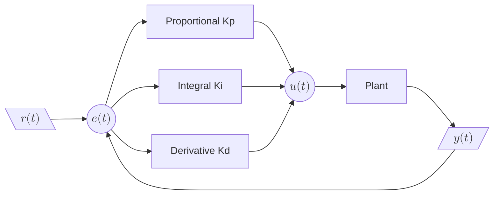

PID做控制的大家都是经常用，之前多是直接抄代码来适配功能，调参。却没有真正意义上去深入理解。

本章主要参考《电动机的单片机控制》一书中，PID控制器一章内容学习总结。

## 1. 模拟PID控制原理

PID控制有基本要件：
- 比例(proportional)、积分(integral)、微分(derivative)。
- PID采集周期（循环周期）也是闭环系统的重要参数，因为有些时候传感器离执行器较远，过程变量改变和观测到该改变之间的时间延迟，也就是不响应期

PID控制系统的原理图:

_**说明**_
- $$ r(t) $$ 为输入值；
- $$ y(t) $$ 为输出值；
- $$ e(t) $$ 为每一次运行后的误差 $$ e(t) = r(t)  - y(t) $$；
- mermaind画出来的真丑；

根据PID控制系统的原理图，容易得出控制器输入的计算公式：

$$ u(t) = K_p \left[ e(t) + \frac{1}{T_i} \int_0^t e(t)\,dt + T_d \frac{d e(t)}{dt} \right] + u_0$$

_**其中**_
- $$ u(t) $$ 控制器输出；
- $$ K_p $$ 是比例增益，对偏差产生快速响应，偏差一出现即刻作用。只能减小偏差，不能消除稳态误差；比例系数过大还会引起系统振荡或不稳定；
- $$ K_i $$ 是积分增益，对偏差进行累加，消除系统的稳态误差。响应慢、易超调，积分常数$$ T_i $$太小会使系统振荡；
- $$ K_d $$ 是微分增益，预测偏差变化趋势（即对偏差的导数作用），加快响应、抑制超调。对高频噪声敏感，易放大误差；
- $$ e(t) $$ 是当前时刻的误差；
- $$ u_0 $$ 控制常量，是在在无误差时仍需要维持输出的那部分“基础控制量”，它是 PID 控制器中的一个静态偏置，保证系统能在稳态持续运转；

> 比例响应 
> 比例模块仅仅取决于设定值和过程变量之间的差值。这个差值被称为“误差”。比例增益决定了输出响应对误差信号的比例。例如，错误项的误差幅值为10，比例增益为5，这将产生比例响应为50。一般情况下，增加比例增益将提高控制系统响应的速度。但是，如果比例增益太大，过程变量会出现振荡。如果继续增加，系统振荡会越来越大，使得系统变得不稳定，以至于失控。

> 积分响应 
> 积分模块将一段时间内的误差相加。即使是一个很小的误差，也会让积分响应缓慢增加。积分响应会根据时间持续增加，除非误差为0。因此，积分响应的目的在于将稳定状态的误差保持在0。稳定状态误差是过程变量和设定值之间的差值。当积分操作满足了控制器的条件，而控制器还未将误差保持在0时，会产生一种称为积分饱和的现象。

> 微分响应 
> 如果过程变量快速增加，微分分量会导致输出减少。微分响应与过程变量的变化率之间成比例关系。增加微分时间（Td）会使控制系统对误差的反应更加剧烈，也会增加整个控制系统的响应时间。大多数实用控制系统使用非常小的微分时间（Td），因为微分响应对过程变量的噪声特别敏感。如传感器反馈信号中有噪声或控制循环速率太低，微分响应会使控制系统变得不稳定

以上是模拟PID的控制原理，并不能实际作用于我们的单片机控制系统。

## 2. 数字PID控制算法

数字PID控制算法可分为位置式PID控制算法和增量式PID控制算法

位置式PID控制算法和增量式PID控制算法之间存在密切的关系，可以通过增量式算法推导出位置式的递推公式。以下是详细的推导过程：

### 2.1. 位置式 PID 控制算法
位置式 PID 的输出 \( u_k \) 直接表示控制量的绝对值，其公式为：

\[
u_k = K_p e_k + K_i \sum_{j=0}^{k} e_j + K_d (e_k - e_{k-1})
\]
其中：
- \( K_p \) 是比例增益，
- \( K_i \) 是积分增益，
- \( K_d \) 是微分增益，
- \( e_k \) 是当前时刻的误差，
- \( \sum_{j=0}^{k} e_j \) 是误差的累加和。

### 2. 增量式 PID 控制算法
增量式 PID 的输出 \( \Delta u_k \) 表示控制量的变化量，其公式为：
\[
\Delta u_k = K_p (e_k - e_{k-1}) + K_i e_k + K_d (e_k - 2e_{k-1} + e_{k-2})
\]
增量式算法只计算当前控制量相对于上一次的变化。

### 3. 从增量式推导位置式的递推公式
位置式的输出 \( u_k \) 可以表示为上一次的输出 \( u_{k-1} \) 加上当前的增量 \( \Delta u_k \)：
\[
u_k = u_{k-1} + \Delta u_k
\]
将增量式 PID 的 \( \Delta u_k \) 代入上式：
\[
u_k = u_{k-1} + K_p (e_k - e_{k-1}) + K_i e_k + K_d (e_k - 2e_{k-1} + e_{k-2})
\]
这就是位置式 PID 的递推计算公式。

### 4. 推导的意义
通过递推公式，位置式 PID 可以避免直接计算误差的累加和 \( \sum_{j=0}^{k} e_j \)，从而减少计算量和内存占用。每次只需保存上一次的输出 \( u_{k-1} \) 和最近的几次误差值 \( e_k, e_{k-1}, e_{k-2} \)，即可完成计算。

### PID整定

PID 调整

设置P、I、D最佳增益，从而得到控制系统理想反馈的过程叫做整定。 PID整定方法有很多种。本文主要介绍试错法和Ziegler Nichols法。

### 总结
位置式 PID 的递推公式 \( u_k = u_{k-1} + \Delta u_k \) 是通过将增量式 PID 的输出 \( \Delta u_k \) 叠加到上一次的输出 \( u_{k-1} \) 上得到的。这种形式简化了实现过程，同时保持了控制算法的完整性。

## 参考资料

[PID控制器及其原理解释](https://www.ni.com/zh-cn/shop/labview/pid-theory-explained.html?srsltid=AfmBOoqWDqgwnvU19vFPLYO2AVHofH_WpVnJrkRhmNcJGRDRGauZNIqa)