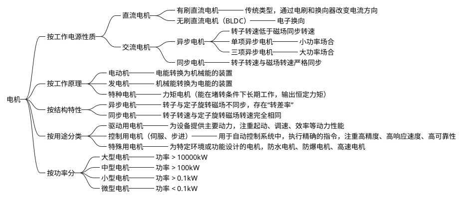

## 1. 电机分类


## 2. 电机基础概念

电机组成：带有绕组的定子、转子、换向器

电机基本原理：基本原理基于电磁力，电能转换为机械能。例如：在直流电机中，定子为固定部分，产生恒定磁场，接着通过换向器不断改变电流方向，使转子收到安培力作用持续转动。

转速公式（无负载情况下）：

$$ n = \frac{60f}{N_p} \quad \text{(rpm)} $$

_**说明**_
- $ n $：转速（转/分钟，rpm）
- $ f $：电源频率（Hz，用于交流电机）
- $ N_p $：电机极对数

电机的启动与运行特性：

有些电机往往需要较大的启动扭矩，因为有可能需要带较大负载情况下启动电机。扭矩是电动机轴转力的大小。

电动机通常用两个参数来标定其技术特性：满负荷电流、堵转电流。
- 满负荷电流：就是额定负荷电流值；
- 堵转电流：即启动电流；
- 一般来说启动电流能达到满负荷电流的五倍；
- 为了应对较大的扭矩，一般设计了启动绕组和运行绕组，启动绕组通过相位差电流与运行绕组共同合成旋转磁场，提供较大的启动转矩（通常为额定转矩的数倍），当转自达到额定转速的75%，离心开关自动切断电源。

电动机启动电路：
``` cmd
   L ──┬─────【运行绕组】──────┐
       │                      │
      【离心开关】             ├─ N
       │                      │
       └──────────【启动绕组】─┘
```

电动机类型：
- 单相启动式电动机
- 分项电动机
- 电容器启动电动机
- 永久分项电容式电动机
- 罩极式电动机
- 三项电动机
- 单项封闭式电动机

此处暂时没有应用场景，以后补充。这块主要应该还是得复习下电机拖动


## 3. 步进电机

> 步进电机是将电脉冲信号，转变为角位移或线位移的开环控制电机，又称为脉冲电机。

特点：
- 数字脉冲控制；
- 开环即可实现定位和速度控制，如果有位置反馈归于伺服电机；
- 低速时具有大扭矩；
- 存在共振现象；高速时扭矩下降；如果负载不当，可能失步或过冲；

### 3.1. 步进电机工作原理

步进电机是由一个永磁转子加上多组电磁铁定子构成。

通过按特定顺序给电机内部定子的线圈（遵循安培右手螺旋定则）通电，产生一个旋转的磁场，从而拖动永磁转子一步步地转动。

### 3.2.  重要概念与技术参数

- 相数 (Phases)：电机内部独立的线圈组数量。
- 步距角 (Step Angle)：每个脉冲信号所对应的转子转动的角度。
- 保持转矩 (Holding Torque)：电机在通电但未转动时，所能保持的最大转矩。衡量电机带载能力的核心指标，单位通常是 N·m 或 kg·cm。
- 失步 (Lost Step) & 过冲 (Overshoot)：
    - 失步：电机收到的脉冲数多于实际转动的步数。常发生在负载转矩 > 电机输出转矩时（如启动速度太快、负载过重）。
    - 过冲：电机转过的步数多于收到的脉冲数。常发生在高速急停时，由于惯性无法立即停下。
- 细分驱动 (Microstepping)：通过精确控制电机相电流，将一个整步细分成若干个小步来运行。例如，16细分就是将1.8°的整步分成16小步，每步0.1125°。
    - 细分是驱动器将上级装置发出的每个脉冲按驱动器设定的细分系数分成系数个脉冲输出，比如步进电机每转一圈为200个脉冲，如果步进电机驱动器细分为32，那么步进电机驱动器需要输出6400个脉冲步进电机才转一圈。

### 3.3. 步进驱动系统

- 控制器 (Controller)：如单片机(STM32, Arduino)、PLC、运动控制卡。负责发出脉冲(PULSE) 和方向(DIRECTION) 信号。
- 驱动器 (Driver)：连接控制器和电机的桥梁。它的核心作用是按控制器的指令，向电机线圈提供所需的大电流。
    - 核心功能：电流放大、分配脉冲、细分控制、保护电路（过流、过热）。
    - 常见芯片/模块：A4988, DRV8825, TMC2208/TMC2209 (静音、高级)。
- 步进电机 (Stepper Motor)：执行机构。

`控制器 --> (脉冲/方向信号) --> 驱动器 --> (大电流) --> 步进电机`

### 3.4. 常见控制算法

加减速算法

直接让电机以高速启动，就像猛地推一把重物，极易导致失步。直接高速下急停，则会因为惯性导致过冲。

加减速算法（如梯形、S型曲线）的作用：
让电机从一个较低的速度平滑地加速到目标高速，再在停止前平滑地减速到零速。

好处：确保电机始终有足够的扭矩跟上指令，防止失步和过冲，保证定位精确，运行平稳，减少机械冲击。


## 交流永磁同步电机


## 参考资料

William C. Whitman, William M. Johnson, John A. Tomczyk. (2016). _《制冷与空气调节技术（第五版）》_