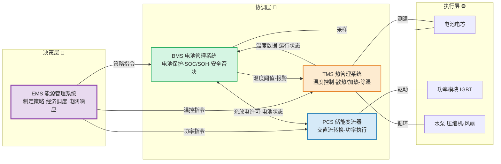
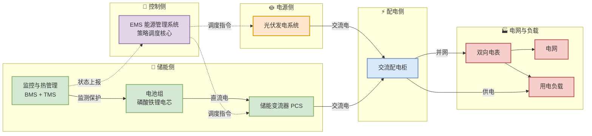

## 1. 储能系统

储能系统简单来说就是一个大号电池，用于存储电力，咱们可以通过它来解决电力系统中的矛盾：
1. 时间错配：光伏白天发电，但大家晚上用电（尤其是居民用电）。储能把白天的电存到晚上用。基于峰谷电价延伸出电价套利（储能系统电价低的时候充电，电价高的时候放电）
1. 空间错配：例如西电东送，西部发的风电，受输电通道容量限制。为缓解通道压力，可在西部就近储存，按需释放再传输到东部。
1. 削峰填谷：工厂开机、电动车快充桩同时使用，会导致电网电压骤降。储能系统可以毫秒级响应，瞬间补上功率，避免跳闸。

一个储能系统通常由几个部分构成：
- EMS：能量管理系统（Energy Management System），根据电力市场价格，用户负荷需求，电池状态指定充放电策略；
- PCS：功率转换系统（Power Conversion System），直流电与交流电相互转化，控制充放电过程；
- BMS：电池管理系统（Battery Management System），检测电池电压、电流、温度的参数，防止电池过程，过放，过热等。确保电池安全和性能稳定。
- TMS：热管理系统（Thermal Management System），防止电池过热、过冷，提升系统可靠性与寿命。

储能系统结构图：

光储一体化系统框图：

## 2. 储能系统的热管理

储能热管理本质上跟空调/热泵的控制并无不同，只是被控对象从人的感受温度转换为电池包温度。甚至底层框架都不用动，控制方案直接从直接空调/热泵的通用控制方案直接移植过来😅。

目前的一些热管理方案[^1]：
- 风冷：成本低、结构简单、工业化成熟度高，导热系数低、温度均匀性差。
- 板式液冷：散热效率高、温度均匀性好、环境适用性广，复杂性高、有泄漏风险、成本高。
- 浸没式液冷：冷却液直接接触电池/芯片，热阻极小，传热面积大，导热效能极高、温度均匀性好、结构紧凑、热阻低，冷却液成本高、密封要求高、系统增重、泵送功耗大。
- 相变材料冷却：能量密度高、温度均匀性优异、无额外能耗，导热系数低、长时间运行易饱和、相变体积膨胀、成本高、工程化不足。

**Q：啥是相变材料冷却？** 
**A**：利用材料融化时大量吸热、自身温度不变的特性，像"冰块吸热"一样控制电池温度。
- 电池发热时 → 相变材料像冰一样“融化”（固体变液体）
- 融化过程中 → 材料吸收大量热量，但自身的温度几乎不升高
- 结果 → 电池的热量被材料“吃掉了”，电池温度被稳稳控制住。

随着储能市场的发展，可能是发现风冷的散热能力不足。于是液冷型逐渐成为主流，目前客户在推的方案大多也是液冷型产品，目前算是比较成熟。

### 2.1. 储能系统的热管理的控制与保护

从软件角度看，热管理本质上就是根据输入信号量来控制被控对象：
- 传感器输入：模组NTC温度点、液冷回路进水/回水温度/流量/压力、环境温湿度
- 控制输出：PWM风扇转速（闭环调节）、水泵启停/转速、压缩机/冷机启停/频率、膨胀阀开度
- 保护逻辑：温差过大限制充放电功率、温度超限/传感器失效告警
- 进一步细化（软起动、平台期、调频点等）就进入了具体的控制规格书范畴，本文不再展开。

在实际项目中，比核心控制逻辑更麻烦的往往是异常场景：传感器读数跳变、通信丢包、水泵卡死反馈信号异常。热管理的软件实现，大量精力花在这些边界条件的处理上。

## 常见问题

## 相关文档

## 参考资料

[^1]: 于洪峰，曹阳阳，许成林，邵宇杰，栗欢欢. (2025). _储能电池热管理及控制策略研究进展_. [https://manu70.magtech.com.cn/dyjs/CN/10.3969/j.issn.1002-087X.2026.01.003](https://manu70.magtech.com.cn/dyjs/CN/10.3969/j.issn.1002-087X.2026.01.003)
